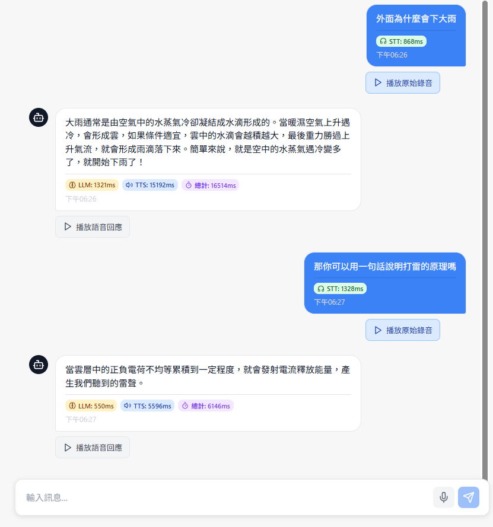

# 🎙️ Realtime Dialogue Bot

結合 STT（語音轉文字）、TTS（文字轉語音）與 LLM（大型語言模型），實現即時的語音對話機器人系統。


## ✨ 主要功能

- 🎤 **即時語音識別**：支持高精度的中文語音轉文字
- 🧠 **智能對話**：整合大型語言模型，提供自然流暢的對話體驗
- 🔊 **多引擎語音合成**：支援 BreezyVoice、VibeVoice、IndexTTS、Spark-TTS 四種 TTS 引擎
- 🎭 **語者克隆**：支援自定義語者音檔進行語音克隆
- 💻 **現代化 UI**：Vue.js 前端，響應式設計，支援桌面和移動端
- ⚡ **高性能優化**：CUDA 加速、模型緩存、混合精度推論

## 🏗️ 專案架構

### 整體目錄結構
```
realtime-dialogue-bot/
├── README.md               # 專案說明文件
├── assets/                 # 靜態資源檔案
├── backend/                # 後端服務
│   ├── app/                # FastAPI 應用程式
│   │   ├── main.py         # API 主程式
│   │   ├── config.py       # 配置管理
│   │   ├── stt.py          # 語音轉文字服務
│   │   ├── chat.py         # LLM 聊天服務
│   │   ├── tts_breezy.py   # BreezyVoice TTS 服務
│   │   ├── tts_vibe.py     # VibeVoice TTS 服務
│   │   ├── tts_index.py    # IndexTTS 服務
│   │   └── tts_spark.py    # Spark-TTS 服務
│   ├── BreezyVoice/        # BreezyVoice 模型原始碼
│   ├── VibeVoice/          # VibeVoice 模型原始碼
│   ├── Spark-TTS/          # Spark-TTS 模型原始碼
│   ├── index-tts/          # IndexTTS 模型原始碼
│   ├── llm_tools/          # LLM 工具和配置
│   │   ├── async_llm_chat.py
│   │   ├── embed_rerank_model.py
│   │   ├── llm_chat.py
│   │   ├── memory.py
│   │   └── configs/        # LLM 模型配置
│   ├── models/             # 預訓練模型目錄
│   │   ├── models--Qwen--Qwen2.5-1.5B/
│   │   ├── models--MediaTek-Research--BreezyVoice-300M/
│   │   ├── models--mobiuslabsgmbh--faster-whisper-large-v3-turbo/
│   │   ├── IndexTTS-1.5/
│   │   ├── Spark-TTS-0.5B/
│   │   └── VibeVoice/
│   ├── voices/             # 語者音檔目錄
│   ├── outputs/            # 生成音頻輸出目錄
│   ├── uploads/            # 上傳檔案暫存目錄
│   ├── config.yaml         # 主要配置檔案
│   ├── requirements.txt    # Python 依賴套件
│   ├── Dockerfile          # 容器化配置
│   └── docker-compose.yml  # 多容器編排
├── frontend/               # 前端應用
│   ├── src/
│   │   ├── App.vue         # 主應用元件
│   │   ├── components/     # Vue 元件
│   │   ├── composables/    # Vue 組合式函數
│   │   ├── router/         # 路由配置
│   │   ├── services/       # API 服務
│   │   └── stores/         # 狀態管理
│   ├── package.json        # Node.js 依賴配置
│   ├── vite.config.js      # Vite 建置配置
│   ├── docker-compose.yml  # 前端容器配置
│   └── start-frontend*.sh  # 前端啟動腳本
└── repo_ref/               # 參考資料和文檔
```

## 🚀 快速開始

### 環境要求
- Python 3.8+
- Node.js 16+
- CUDA 11.8+ (推薦使用 GPU)
- Docker & Podman (容器化部署)

### 1. Clone 專案
```bash
git clone https://github.com/fbpaul/realtime-dialogue-bot.git
cd realtime-dialogue-bot
```

### 2. 後端設置
- 參照後端的 [README.md](backend/README.md)

### 3. 前端設置
- 參照前端的 [README.md](frontend/README.md)

## 📊 系統性能分析

### TTS 性能
- **IndexTTS**: 最快的合成速度，平均 RTF ≈ 0.45，適合即時應用，但中國口音較重
- **VibeVoice**: RTF ≈ 0.82，如果克隆語者音檔品質不佳，無法生成好的聲音
- **Spark-TTS**: 近即時性能，RTF ≈ 1.0，接近實時合成，中國口音重
- **BreezyVoice**: RTF ≈ 1.5-3.0，較低的中國口音，但會跳針，導致速度評估起來很慢 (莫名生成太長的語音)

*RTF (Real Time Factor): 值越小表示合成速度越快。RTF=1.0 表示實時合成速度*

### 詳細測試結果

基於標準測試用例的 RTF (Real Time Factor) 性能測試結果：

#### BreezyVoice 測試結果
| 文本 | 語者 | RTF | 合成時間 | 音頻長度 |
|------|------|-----|----------|----------|
| 短文字 | Speaker1 | 2.230 | 22.088s | 9.903s |
| 短文字 | Speaker2 | 2.176 | 42.799s | 19.667s |
| 短文字 | Speaker3 | 3.095 | 19.582s | 6.327s |
| 中等文字 | Speaker1 | 1.569 | 22.710s | 14.478s |
| 中等文字 | Speaker2 | 1.713 | 62.698s | 36.595s |
| 中等文字 | Speaker3 | 2.859 | 23.232s | 8.127s |
| 長文字 | Speaker1 | 1.901 | 28.208s | 14.838s |
| 長文字 | Speaker2 | 1.967 | 81.422s | 41.390s |
| 長文字 | Speaker3 | 2.302 | 21.195s | 9.207s |

#### VibeVoice 測試結果
| 文本 | 語者 | RTF | 合成時間 | 音頻長度 |
|------|------|-----|----------|----------|
| 短文字 | Speaker1 | 1.019 | 7.065s | 6.933s |
| 短文字 | Speaker2 | 0.851 | 6.124s | 7.200s |
| 短文字 | Speaker3 | 0.831 | 5.427s | 6.533s |
| 中等文字 | Speaker1 | 0.820 | 12.906s | 15.733s |
| 中等文字 | Speaker2 | 0.827 | 8.379s | 10.133s |
| 中等文字 | Speaker3 | 0.822 | 8.216s | 10.000s |
| 長文字 | Speaker1 | 0.819 | 10.488s | 12.800s |
| 長文字 | Speaker2 | 0.822 | 9.096s | 11.067s |
| 長文字 | Speaker3 | 0.820 | 9.951s | 12.133s |

#### IndexTTS 測試結果
| 文本 | 語者 | RTF | 合成時間 | 音頻長度 |
|------|------|-----|----------|----------|
| 短文字 | Speaker1 | 0.540 | 4.079s | 7.552s |
| 短文字 | Speaker2 | 0.439 | 3.314s | 7.552s |
| 短文字 | Speaker3 | 0.483 | 3.070s | 6.357s |
| 中等文字 | Speaker1 | 0.444 | 4.541s | 10.240s |
| 中等文字 | Speaker2 | 0.426 | 4.367s | 10.240s |
| 中等文字 | Speaker3 | 0.446 | 4.358s | 9.771s |
| 長文字 | Speaker1 | 0.445 | 4.972s | 11.179s |
| 長文字 | Speaker2 | 0.444 | 4.890s | 11.008s |
| 長文字 | Speaker3 | 0.448 | 4.489s | 10.027s |

#### Spark-TTS 測試結果
| 文本 | 語者 | RTF | 合成時間 | 音頻長度 |
|------|------|-----|----------|----------|
| 短文字 | Speaker1 | 1.160 | 9.302s | 8.020s |
| 短文字 | Speaker3 | 1.032 | 5.245s | 5.080s |
| 中等文字 | Speaker1 | 1.004 | 10.484s | 10.440s |
| 中等文字 | Speaker3 | 1.009 | 8.414s | 8.340s |
| 長文字 | Speaker1 | 1.000 | 10.476s | 10.480s |
| 長文字 | Speaker3 | 1.002 | 8.680s | 8.660s |


### 系統性能指標
- **STT 延遲**: ~500-800ms
- **LLM 響應**: ~600-900ms  
- **TTS 合成**: ~2-7s (取決於引擎和文字長度)
- **端到端延遲**: ~3-8s


## 📚 相關文檔

- [後端配置指南](backend/CONFIG_GUIDE.md)
- [部署方式說明](backend/部署方式.md)
- [前端開發文檔](frontend/README.md)
- [API 文檔](http://localhost:8000/docs) (服務運行時可訪問)


## 📜 授權條款

本專案採用 MIT 授權條款 - 詳見 [LICENSE](LICENSE) 檔案

## 👥 開發團隊

- **主要開發者**: paul.fc.tsai
- **專案維護**: paul.fc.tsai