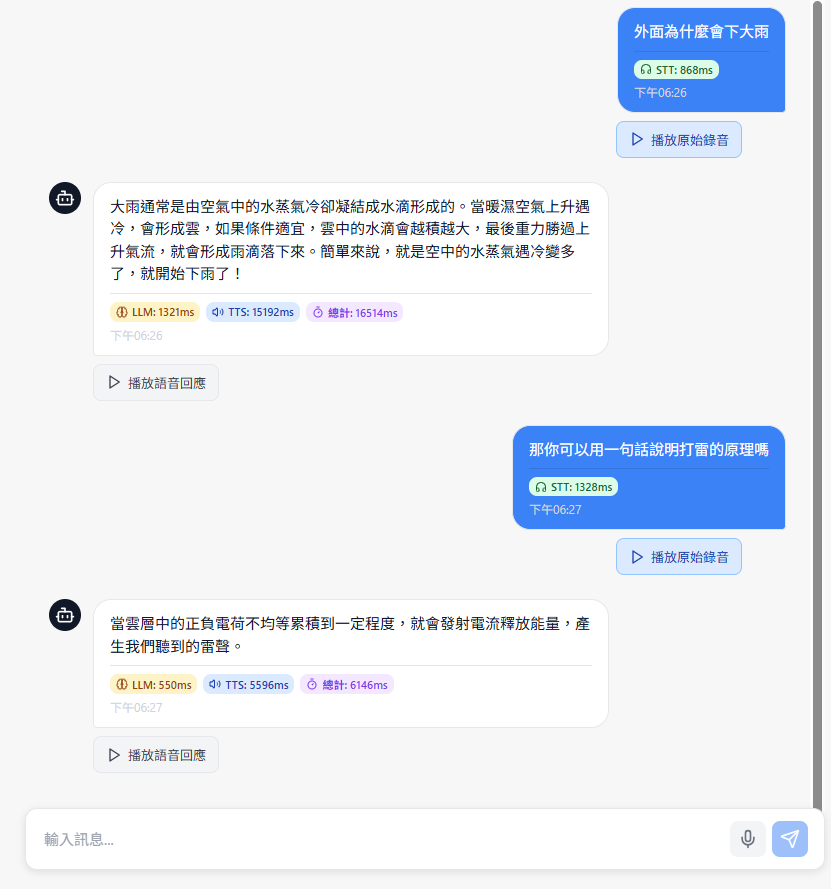

<p align="center">
  
</p>

<div align="center">
A real-time dialogue bot system that integrates STT (Speech-to-Text), TTS (Text-to-Speech), and LLM (Large Language Model) for seamless voice conversations.

[English](README_EN.md) | [中文](README.md)

</div>

---

## 1. Introduction

**Realtime Dialogue Bot** combines **Speech-to-Text (STT)**, **Text-to-Speech (TTS)**, and **Large Language Model (LLM)** technologies to create an **intelligent voice conversation system** that enables natural, real-time voice interactions.

**Core workflow:**
```
Voice Input → STT → LLM Processing → TTS → Voice Output
```

The system supports multiple TTS engines, voice cloning capabilities, and provides a modern web interface for seamless user experience.

---

## 2. Supported Features & Engines

| Feature                      | BreezyVoice | VibeVoice | IndexTTS | Spark-TTS |
| ---------------------------- |:---:|:---:|:---:|:---:|
| **Real-time Synthesis**      | ⚠️ | ✅ | ✅ | ✅ |
| **Voice Cloning**            | ✅ | ✅ | ✅ | ✅ |
| **Chinese Accent**           | Low | Medium | Heavy | Heavy |
| **Synthesis Speed (RTF)**    | 1.5-3.0 | ~0.82 | ~0.45 | ~1.0 |
| **Audio Quality**            | High | High | Medium | High |
| **Stability**                | ⚠️ | ✅ | ✅ | ✅ |

**Performance Notes:**
- **IndexTTS**: Fastest synthesis speed, ideal for real-time applications
- **VibeVoice**: Good balance of speed and quality, requires high-quality voice samples
- **Spark-TTS**: Near real-time performance with good audio quality
- **BreezyVoice**: Excellent quality but may have audio artifacts causing longer generation times

---

## 3. Installation

### Environment Requirements
- Python 3.8+
- Node.js 16+
- CUDA 11.8+ (GPU recommended)
- Docker & Podman (for containerized deployment)

### Quick Setup
```bash
# Clone the repository
git clone https://github.com/fbpaul/realtime-dialogue-bot.git
cd realtime-dialogue-bot

# Backend setup (see backend/README.md for detailed instructions)
cd backend
pip install -r requirements.txt

# Frontend setup (see frontend/README.md for detailed instructions)  
cd frontend
npm install
```

---

## 4. Usage

### 4.1 Backend Service

Start the FastAPI backend server:

```bash
cd backend
python start_server.py
```

The backend provides the following API endpoints:
- `/chat` - LLM conversation endpoint
- `/stt` - Speech-to-Text conversion
- `/tts/breezy` - BreezyVoice TTS synthesis
- `/tts/vibe` - VibeVoice TTS synthesis
- `/tts/index` - IndexTTS synthesis
- `/tts/spark` - Spark-TTS synthesis

<details>
<summary>Example API usage (click to expand)</summary>

```python
import requests
import json

# STT Example
with open("audio.wav", "rb") as f:
    response = requests.post("http://localhost:8000/stt", files={"file": f})
    text = response.json()["text"]
    print(f"Recognized text: {text}")

# Chat Example
response = requests.post(
    "http://localhost:8000/chat",
    json={"message": "Hello, how are you?"}
)
reply = response.json()["response"]
print(f"Bot reply: {reply}")

# TTS Example
response = requests.post(
    "http://localhost:8000/tts/index",
    json={
        "text": "Hello, this is a test message",
        "speaker": "Speaker1"
    }
)
with open("output.wav", "wb") as f:
    f.write(response.content)
```

</details>

---

### 4.2 Frontend Application

Start the Vue.js frontend:

```bash
cd frontend
npm run dev
```

The frontend provides:
- **Real-time Voice Chat**: Click-to-talk voice interaction
- **Phone Sales Simulation**: AI-powered sales conversation training
- **Multi-TTS Engine Selection**: Choose from 4 different TTS engines
- **Voice Cloning Setup**: Upload custom voice samples
- **Responsive Design**: Works on desktop and mobile devices

<details>
<summary>Frontend features overview (click to expand)</summary>

**Main Components:**
- `VoiceChat.vue` - Primary voice interaction interface
- `PhoneSalesSimulation.vue` - Specialized sales training module
- `useAudioRecorder.js` - Audio recording composable
- Pinia stores for state management

**Key Features:**
- WebRTC-based audio recording
- Real-time audio visualization
- Conversation history management
- Settings panel for TTS engine selection
- Mobile-responsive design

</details>

---

### 4.3 Docker Deployment

Deploy the entire system using Docker:

```bash
# Backend deployment
cd backend
docker-compose up -d

# Frontend deployment
cd frontend
docker-compose up -d
```

<details>
<summary>Docker configuration details (click to expand)</summary>

**Backend Docker Setup:**
- CUDA-enabled base image for GPU acceleration
- Model download and caching
- Multi-stage build for optimized image size
- Health checks and restart policies

**Frontend Docker Setup:**  
- Nginx-based static file serving
- Production build optimization
- Configurable API endpoints
- SSL/TLS support ready

</details>

---

## 5. System Architecture

### 5.1 Project Structure

```
realtime-dialogue-bot/
├── README.md               # Project documentation
├── assets/                 # Static assets
├── backend/                # Backend services
│   ├── app/                # FastAPI application
│   │   ├── main.py         # API main entry
│   │   ├── config.py       # Configuration management
│   │   ├── stt.py          # Speech-to-Text service
│   │   ├── chat.py         # LLM chat service
│   │   ├── tts_breezy.py   # BreezyVoice TTS service
│   │   ├── tts_vibe.py     # VibeVoice TTS service
│   │   ├── tts_index.py    # IndexTTS service
│   │   └── tts_spark.py    # Spark-TTS service
│   ├── models/             # Pre-trained models
│   ├── voices/             # Voice samples for cloning
│   ├── outputs/            # Generated audio outputs
│   ├── config.yaml         # Main configuration file
│   └── requirements.txt    # Python dependencies
└── frontend/               # Frontend application
    ├── src/
    │   ├── App.vue         # Main application component
    │   ├── components/     # Vue components
    │   ├── composables/    # Vue composables
    │   ├── router/         # Route configuration
    │   ├── services/       # API services
    │   └── stores/         # State management
    ├── package.json        # Node.js dependencies
    └── vite.config.js      # Build configuration
```

### 5.2 Performance Metrics

**System Performance Indicators:**
- **STT Latency**: ~500-800ms
- **LLM Response**: ~600-900ms  
- **TTS Synthesis**: ~2-7s (depends on engine and text length)
- **End-to-End Latency**: ~3-8s

**Detailed TTS Performance Test Results:**

#### BreezyVoice Test Results
| Text Type | Speaker | RTF | Synthesis Time | Audio Length |
|-----------|---------|-----|----------------|--------------|
| Short     | Speaker1 | 2.230 | 22.088s | 9.903s |
| Short     | Speaker2 | 2.176 | 42.799s | 19.667s |
| Short     | Speaker3 | 3.095 | 19.582s | 6.327s |
| Medium    | Speaker1 | 1.569 | 22.710s | 14.478s |
| Medium    | Speaker2 | 1.713 | 62.698s | 36.595s |
| Medium    | Speaker3 | 2.859 | 23.232s | 8.127s |
| Long      | Speaker1 | 1.901 | 28.208s | 14.838s |
| Long      | Speaker2 | 1.967 | 81.422s | 41.390s |
| Long      | Speaker3 | 2.302 | 21.195s | 9.207s |

#### VibeVoice Test Results
| Text Type | Speaker | RTF | Synthesis Time | Audio Length |
|-----------|---------|-----|----------------|--------------|
| Short     | Speaker1 | 1.019 | 7.065s | 6.933s |
| Short     | Speaker2 | 0.851 | 6.124s | 7.200s |
| Short     | Speaker3 | 0.831 | 5.427s | 6.533s |
| Medium    | Speaker1 | 0.820 | 12.906s | 15.733s |
| Medium    | Speaker2 | 0.827 | 8.379s | 10.133s |
| Medium    | Speaker3 | 0.822 | 8.216s | 10.000s |
| Long      | Speaker1 | 0.819 | 10.488s | 12.800s |
| Long      | Speaker2 | 0.822 | 9.096s | 11.067s |
| Long      | Speaker3 | 0.820 | 9.951s | 12.133s |

#### IndexTTS Test Results
| Text Type | Speaker | RTF | Synthesis Time | Audio Length |
|-----------|---------|-----|----------------|--------------|
| Short     | Speaker1 | 0.540 | 4.079s | 7.552s |
| Short     | Speaker2 | 0.439 | 3.314s | 7.552s |
| Short     | Speaker3 | 0.483 | 3.070s | 6.357s |
| Medium    | Speaker1 | 0.444 | 4.541s | 10.240s |
| Medium    | Speaker2 | 0.426 | 4.367s | 10.240s |
| Medium    | Speaker3 | 0.446 | 4.358s | 9.771s |
| Long      | Speaker1 | 0.445 | 4.972s | 11.179s |
| Long      | Speaker2 | 0.444 | 4.890s | 11.008s |
| Long      | Speaker3 | 0.448 | 4.489s | 10.027s |

#### Spark-TTS Test Results
| Text Type | Speaker | RTF | Synthesis Time | Audio Length |
|-----------|---------|-----|----------------|--------------|
| Short     | Speaker1 | 1.160 | 9.302s | 8.020s |
| Short     | Speaker3 | 1.032 | 5.245s | 5.080s |
| Medium    | Speaker1 | 1.004 | 10.484s | 10.440s |
| Medium    | Speaker3 | 1.009 | 8.414s | 8.340s |
| Long      | Speaker1 | 1.000 | 10.476s | 10.480s |
| Long      | Speaker3 | 1.002 | 8.680s | 8.660s |

*RTF (Real Time Factor): Lower values indicate faster synthesis speed. RTF=1.0 means real-time synthesis speed*

---

## 6. Configuration Guide

### 6.1 Backend Configuration

Edit `backend/config.yaml` to customize system settings:

```yaml
# Model configurations
models:
  stt_model: "mobiuslabsgmbh/faster-whisper-large-v3-turbo"
  llm_model: "Qwen/Qwen2.5-1.5B"
  
# TTS engine settings
tts:
  default_engine: "index"  # breezy, vibe, index, spark
  voice_clone_enabled: true
  
# Performance settings
performance:
  cuda_enabled: true
  mixed_precision: true
  model_cache: true
```

### 6.2 Voice Cloning Setup

1. Prepare voice samples (WAV format, 16kHz, mono)
2. Place samples in `backend/voices/` directory
3. Configure speaker settings in `config.yaml`
4. Test voice cloning through the API

---

## 7. Development

### 7.1 Adding New TTS Engines

To integrate a new TTS engine:

1. Create a new TTS service file: `app/tts_newengine.py`
2. Implement the TTS interface
3. Add configuration settings
4. Register the endpoint in `main.py`
5. Update frontend engine selection

### 7.2 Extending LLM Capabilities

To add new LLM features:

1. Modify `app/chat.py` for new conversation logic
2. Update prompt templates in `llm_tools/configs/`
3. Add memory management if needed
4. Test with different model configurations

---

## 8. Documentation

- [Backend Configuration Guide](backend/CONFIG_GUIDE.md)
- [Deployment Instructions](backend/部署方式.md)
- [Frontend Development Guide](frontend/README.md)
- [API Documentation](http://localhost:8000/docs) (available when service is running)

---

## 9. License

This project is licensed under the MIT License - see the [LICENSE](LICENSE) file for details.

---

## 10. Development Team

- **Lead Developer**: paul.fc.tsai
- **Project Maintainer**: paul.fc.tsai
- **Repository**: [fbpaul/realtime-dialogue-bot](https://github.com/fbpaul/realtime-dialogue-bot)
